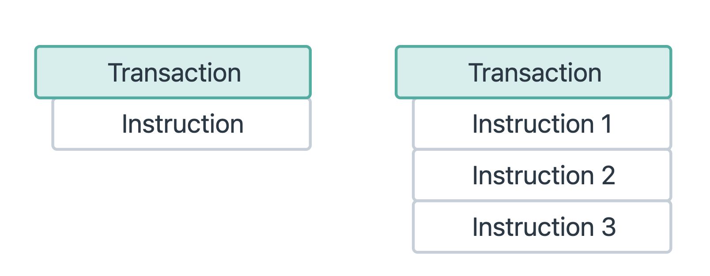

# WTF Solana Web3.js 极简教程: 3. 发送交易: SOL转账

WTF Solana Web3.js 极简教程属于 WTF Solana 教程的一部分，由 WTF Academy 和 ChainBuff 共同推出。

**推特**：[@0xAA_Science](https://twitter.com/0xAA_Science) ｜ [@WTFAcademy_](https://twitter.com/WTFAcademy_) ｜ [@ChainBuff](https://twitter.com/ChainBuff)

**WTF Academy 社群：** [官网 wtf.academy](https://wtf.academy) | [微信群申请](https://docs.google.com/forms/d/e/1FAIpQLSe4KGT8Sh6sJ7hedQRuIYirOoZK_85miz3dw7vA1-YjodgJ-A/viewform?usp=sf_link) ｜ [Discord](https://discord.gg/5akcruXrsk)

所有代码和教程开源在 GitHub: [github.com/WTFAcademy/WTF-Solana](https://github.com/WTFAcademy/WTF-Solana)

---

## 1. Solana 交易中的 Instruction 与 Transaction

在 Solana 中，**一次交易（Transaction）** 是由一个或多个 **指令（Instruction）** 组成的。

指令可以理解为一条链上操作，例如“转账”、“调用合约”。

一次交易可以包含一个或多个指令，并且每笔交易必须包含：**账户信息**、**指令**、**签名者**。交易构建后需签名并发送，才能被验证者节点打包进区块。

交易是“原子的”——所有指令必须成功处理，否则整个交易失败并且不会发生任何变化。



## 2. 连接 Solana 主网

在 web3.js 中，`Connection` 是连接 Solana 节点的核心类，提供链上查询、交易广播、确认状态等功能。

### 主网 / 测试网 / 本地网对比：

| 网络 | 用途 | 地址 | 是否真实资产 |
|------|------|------|---------------|
| `mainnet-beta` | 生产环境 | https://api.mainnet-beta.solana.com | ✅ 是 |
| `devnet` | 开发测试 | https://api.devnet.solana.com | ❌ 否 |
| `testnet` | 节点测试 | https://api.testnet.solana.com | ❌ 否 |
| `localhost` | 本地测试 | http://127.0.0.1:8899 | ❌ 否 |

> 本讲使用主网（mainnet-beta），请谨慎操作，**所有转账均为真实资产！**

```ts
import { Connection, clusterApiUrl } from "@solana/web3.js";

// 连接主网
const connection = new Connection(clusterApiUrl("mainnet-beta"), "confirmed");
```

## 3. 构建一笔主网上的 SOL 转账

我们将从本地导入私钥，向另一个地址转账 0.001 SOL，并广播交易。

首先，我们使用 `SystemProgram.transfer` 构建转账指令，然后我们使用 "new Transaction()" 创建一笔交易，然后使用 "Transaction().add()" 将转账指令添加到交易中，最后通过 `sendAndConfirmTransaction` 签名并广播到链上。

### 示例代码：03_Transfer.ts

```ts
import {
    Connection,
    clusterApiUrl,
    Keypair,
    PublicKey,
    LAMPORTS_PER_SOL,
    SystemProgram,
    Transaction,
    sendAndConfirmTransaction,
  } from "@solana/web3.js";
import bs58 from "bs58";
import fs from "fs";

// 连接主网
const connection = new Connection(clusterApiUrl("mainnet-beta"), "confirmed");

// 从本地导入发送者私钥（请确保保密）
const secretKeyBase58 = fs.readFileSync("wallet.txt", "utf-8");
const sender = Keypair.fromSecretKey(bs58.decode(secretKeyBase58));

// 接收者地址（可以改为你的另一个钱包）
const receiver = new PublicKey("4xxeGf2jZAyLVW1sEELTJy2Fd4hwRerNTDCg8ZQuH4tn");

const main = async () => {
   // 1. 打印当前发送者余额
   const balance = await connection.getBalance(sender.publicKey);
   console.log(`当前余额: ${balance / LAMPORTS_PER_SOL} SOL`);

   // 2. 构建转账指令（0.001 SOL）
   const instruction = SystemProgram.transfer({
   fromPubkey: sender.publicKey,
   toPubkey: receiver,
   lamports: 0.001 * LAMPORTS_PER_SOL,
   });

   // 3. 创建交易
   const transaction = new Transaction().add(instruction);

   
   // 4. 模拟交易
   const simulateResult = await connection.simulateTransaction(transaction, [sender]);
   console.log("模拟交易结果: ", simulateResult);

   // 5. 发送交易
   console.log("正在发送交易...");
   const signature = await sendAndConfirmTransaction(connection, transaction, [sender]);

   console.log("交易成功！交易哈希:", signature);
   console.log(`查看交易：https://solscan.io/tx/${signature}?cluster=mainnet-beta`);
};

main();
```

### 输出样例

```
当前余额: 0.1 SOL
模拟交易结果:  {
  context: { apiVersion: '2.2.14', slot: 341716177 },
  value: {
    accounts: null,
    err: null,
    innerInstructions: null,
    logs: [
      'Program 11111111111111111111111111111111 invoke [1]',
      'Program 11111111111111111111111111111111 success'
    ],
    replacementBlockhash: null,
    returnData: null,
    unitsConsumed: 150
  }
}
正在发送交易...
交易成功！交易哈希: 3vr9oZwTcdbLGJfMEX5auy82FFScMBfb5fzfj5SELMqzGuCCNqPV44QsE8rQVTTTmbqTenM1Eogh7aaeN1jnup8g
查看交易：https://solscan.io/tx/3vr9oZwTcdbLGJfMEX5auy82FFScMBfb5fzfj5SELMqzGuCCNqPV44QsE8rQVTTTmbqTenM1Eogh7aaeN1jnup8g?cluster=mainnet-beta
```

## 4. 总结

这一讲，我们：
- 了解了 Solana 交易中的 Instruction 与 Transaction
- 了解如何使用 `Connection` 类连接到 Solana 主网
- 使用 `SystemProgram.transfer` 发起一笔真实的 SOL 转账
